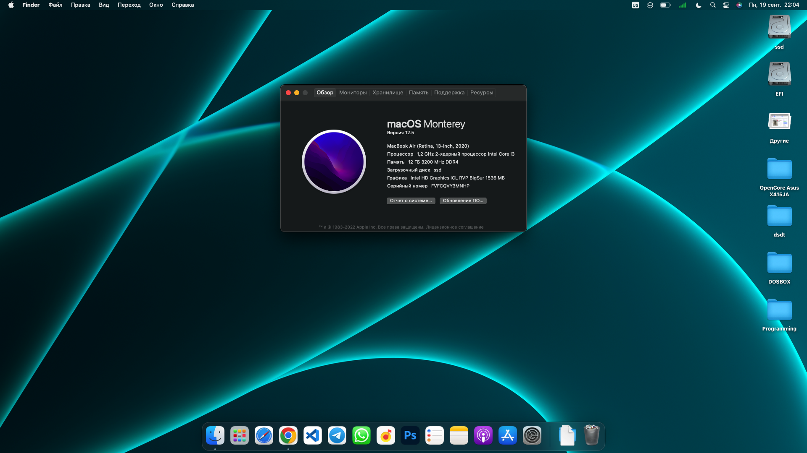

# OPENCORE ASUS-Vivobook-X415JA
- MacOS Catalina 10.15.7
- MacOS BigSur 11.x
- MacOS Monterey 12.x
---


> ## How To Get
```
git clone https://github.com/exxxt4zy/opencore-vivobook-x415ja
```
> ## ASUS VivoBook Specs
- [x] <b>Model</b>: Asus Vivobook X415JA
- [x] <b>CPU</b>: Intel Core i3-1005G1
- [x] <b>Chipset</b>: Intel® QM77 Express Chipset
- [x] <b>iGPU</b>: Intel UHD Graphics @ 2GB
- [x] <b>RAM</b>: 12GB DDR4 PC25600 / 3200Mhz
- [x] <b>Storage</b>: 128GB Intel NVME (GUID Partition Table)
- [x] <b>Audio</b>: Realtek ALC256 HD Audio Controller
- [x] <b>Wifi</b>: Realtek 8821CE Wirelees LAN 
- [x] <b>Trackpad</b>: ASUE1409 I2C Interface
- [x] <b> Monitor</b>: IPS FHD (1980x1080) 60Mhz
- [x] <b>BOOT Loader</b>: OpenCore
- [x] <b>BOOT Mode</b>: UEFI


<details>
<summary><strong> What's Worked </strong></summary>
<br>

| Feature                              | Status |
| :----------------------------------- | ------ |
| Graphics                             |✅      |
| Audio ALC256                         |✅      |
| TouchPad - All Gestures              |✅      |
| Keyboard                             |✅      |
| FN Keys                              |✅      |
| Sleep                                |✅      |
| Battery indicator                    |✅      |
| USB 3.0 and type-c                   |✅      |
| WIFI Realtek Unsupported             |🟥      |
| WebCam                               |✅      |

</details>

<details>
<summary><strong> Credits </strong></summary>
<br>

- [Apple](https://www.apple.com) for macOS.
- [Acidanthera](https://github.com/acidanthera) for all the kexts/utilities that they made.
- [Rehabman](https://github.com/RehabMan) and [Daliansky](https://github.com/daliansky) for the patches and guides and kexts.
- [Dortania](https://github.com/dortania) for for the OpenCore Install Guide.

</details>
